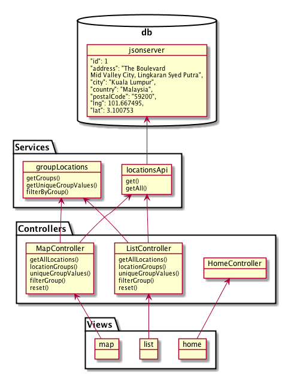

# Single Page Map App

## SPEC
Providing location info in JSON format ([location.json]("https://github.com/aaronmyatt/baeapp/blob/master/location.json")). Let’s build a single page application:
<ol>
    <li>Group those location by country and city.</li>
    <li>Show the location with address, city and post with its location in map.</li>
    <li>Provide documentation about technology used and flow.</li>
    <li>Unit test is optional</li>
</ol>

### Dev Environment [Dependencies](https://github.com/aaronmyatt/baeapp/blob/master/package.json):

- gulp
- gulp-angular-protractor
- gulp-if
- gulp-jasmine
- gulp-sass
- browser-sync
- karma
- karma-chrome-launcher
- karma-jasmine
- karma-spec-reporter
- json-server
- angular-mocks

> All the above packages (except `json-server` and `angular-mocks` are wired together in the [gulpfile.js](https://github.com/aaronmyatt/baeapp/blob/master/gulpfile.js) to provide a set of convenient build and development environment functions.

> In particular, automatic compilation and injection of new CSS and HTML changes using BrowserSync and SASS packages. Automatic Jasmine unit test runner and optional Protractor GUI test runner when the `TESTUI` environment variable is set (See below).

> `json-server` and `angular-mocks` are used independently, the former provides a convenient development only JSON api to mock out server dependencies and `angular-mocks` provides a few conveniences for testing AngularJS.

#### Terminal commands to get the dev environment running

> Optional, but highly encouraged, run these commands from a virtual environment, such as: [nodeenv](https://github.com/ekalinin/nodeenv)

1. `npm install`
2. `webdriver-manager update && webdriver-manager start`
3. `json-server locations.json --watch`
4. `gulp`

OPTIONALLY: `NODE_ENV="TESTUI" gulp`

1. Install all dependencies from NPM/package.json
2. Starts the Protractor (Selenium) webdriver.
3. Starts the development JSON API on port :3000
4. Starts all watch tasks including a development server on port :3001
5. Optionally, you can pass the `NODE_ENV="TESTUI"` environment variable to include automatic Protractor test running (though this is slow and not desirable to have active permanently)

### Prod Environment [Dependencies](https://github.com/aaronmyatt/baeapp/blob/master/package.json):

- angular
- angular-animate
- angular-aria
- angular-material
- angular-material-icons
- angular-messages
- angular-route
- angular-sanitize
- ngmap

> The production environment is, obviously, heavily [AngularJS](https://angularjs.org/) oriented and thus only requires familiarity with the [framework](https://angularjs.org/) to grok.

Two packages of note, however, are the wonderful [`angular-material`](https://material.angularjs.org/latest/) which provides a pre-made set of components to build Material Design UIs and the fantastic [`ngmaps`](https://ngmap.github.io/) which makes working with the Google Map API a breeze!

### App architecture and flow

For a little more insight regarding the app design and data flow the following diagram should suffice:

